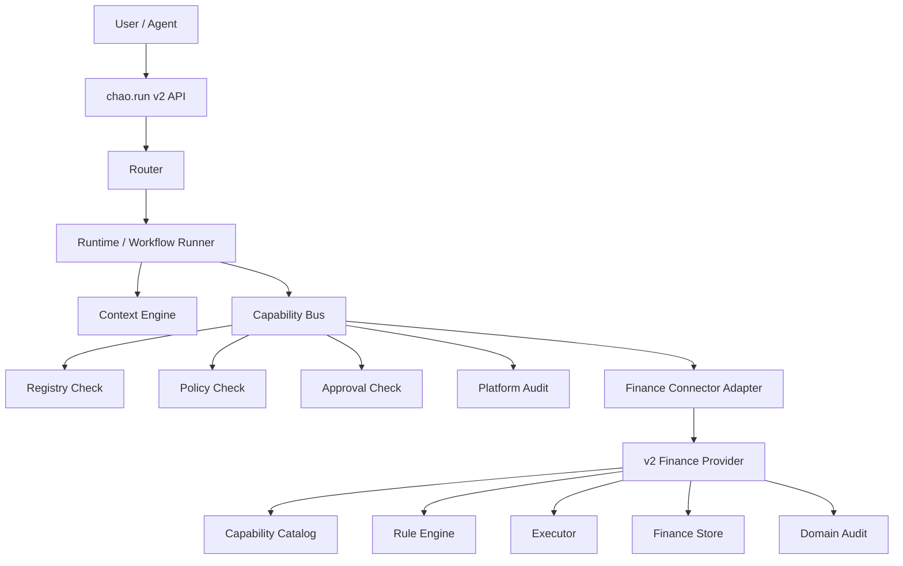

# v2 Finance Provider 架构设计

## 1. 目标

新建一个符合 `chao.run v2` 边界的 Finance Provider。

它应从第一天开始使用：

```text
entity_id + book_id
```

而不是旧 finance 的：

```text
tenant_id
```

Finance Provider 是领域能力服务，不是 Agent 平台。

## 2. 架构位置



调用链必须从 v2 Capability Bus 进入 Finance Provider。

Finance Provider 不应被 Agent、Workflow 或 Model 直接调用。

## 3. 模块拆分

建议模块：

```text
cmd/finance-provider/
internal/api/
internal/provider/
internal/capability/
internal/service/
internal/rule/
internal/store/
internal/audit/
internal/resource/
internal/idempotency/
internal/config/
```

### `internal/provider`

Provider 合约实现：

- list capabilities
- get context
- preview
- validate
- execute
- read resource

### `internal/capability`

Finance 能力目录：

- capability metadata
- side effect
- input schema
- output schema
- permission hint
- idempotency requirement
- dry-run support

### `internal/service`

领域服务：

- invoice service
- journal service
- book service
- period service
- report service
- tax service
- risk service
- consistency service

### `internal/rule`

确定性规则：

- invoice validation
- journal balance validation
- period close validation
- tax calculation
- report calculation
- invoice-account-tax consistency
- risk rule evaluation

### `internal/store`

持久化接口和实现。

Store API 使用 `entityID`，不要使用 `tenantID`。

### `internal/audit`

Finance 领域审计。

它记录业务证据，但平台级权限、审批和执行审计仍由 v2 负责。

## 4. Provider 不拥有的职责

Finance Provider 不实现：

- Agent Runtime
- Planner
- Proposal
- Conversation memory
- Human approval grant
- Capability publication
- Registry trust decision
- Model provider routing
- Cross-entity policy decision

这些都由 v2 平台负责。

## 5. Entity 与 Book

Finance Provider 必须以 `entity_id` 作为隔离键。

推荐关系：

```text
entity_id
  -> accounting_books
    -> accounting_periods
    -> invoices
    -> journal_entries
    -> tax_profiles
    -> reports
```

规则：

- 所有写入必须带 `entity_id`。
- 所有读取必须按 `entity_id` 过滤。
- 所有 `book_id` 必须校验归属。
- 默认账本解析为 `entity_id -> default book`。

## 6. Side Effect 模型

Finance capability 必须声明 side effect：

```text
read
draft_write
committed_write
destructive
```

建议默认：

- 查询、报表预览：`read`
- 创建草稿、风险扫描草稿：`draft_write`
- 审核、过账、关账、锁账：`committed_write`
- 作废、重开、删除：`destructive`

## 7. LLM 边界

LLM 可以做：

- 发票 OCR / 结构化抽取
- 科目建议
- 风险解释
- 报表解释
- 整改建议

LLM 不能做：

- 税额最终计算
- 申报字段最终值
- 凭证是否可过账的最终判断
- 会计期间是否可关闭的最终判断
- 审批结果
- destructive 操作执行

Finance LLM 请求必须通过 v2 model governance，并带：

```json
{
  "domain": "finance",
  "sovereign": true,
  "guard_profile": "finance"
}
```

如果主权模型不可用，必须 fail closed。

## 8. 推荐 MVP

首个可交付闭环：

```text
invoice.create_draft
  -> invoice.approve
  -> journal.create_draft
  -> approval gate in v2
  -> journal.post
  -> report.trial_balance
```

MVP 必须证明：

- entity isolation
- book ownership check
- approval-gated committed write
- idempotency
- platform audit and domain audit linkage
- deterministic validation
